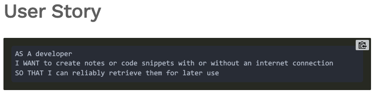
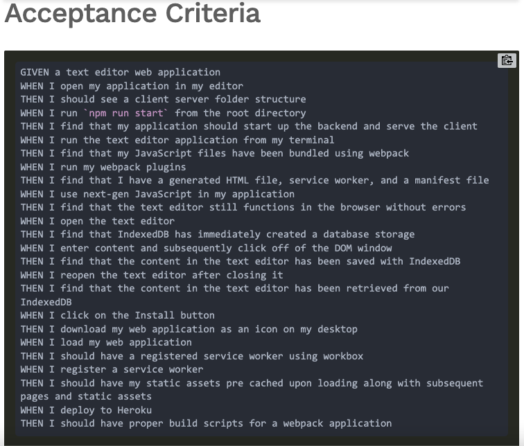

# PWA Text Editor

# Table of Contents 
* [Description](#description) 
* [Installation](#installation)
* [License](#license)
* [Contributing](#contributing)
* [Questions](#questions)
        
## Description 
Your task is to build a text editor that runs in the browser. The app will be a single-page application that meets the PWA criteria. Additionally, it will feature a number of data persistence techniques that serve as redundancy in case one of the options is not supported by the browser. The application will also function offline

## Mock-Up

### User Story 

### Acceptance Criteria 

## Walkthrough 

## Installation
to use this application one must install 
* idb
* Run 'npm install'
* 'npm start dev'
* 'npm run build' 

## License 
MIT license 

## Contributing 
William Wright

## Questions
Reach out to me regarding question at,
    * Github: <a href="https://github.com/wrightw404">wrightw404</a>
    * Email: <a href="mailto:Wrightw404@gmail.com">Wrightw404@gmail.com</a>